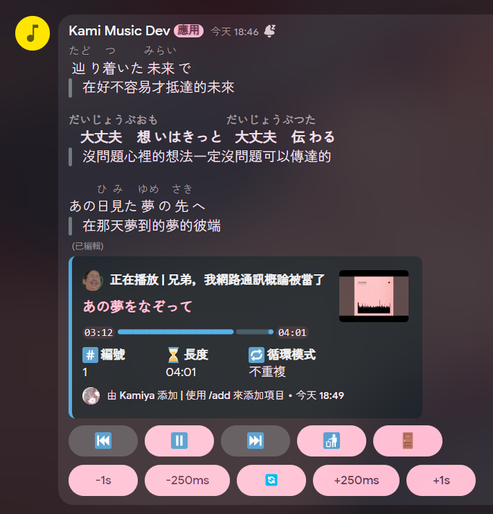

# Kami Music

> [!TIP]
> 這隻機器人是 Kami Bot 的音樂分支  
> 如果你在找 Kami Bot 的話可以在 [kamiya10/kami-bot](https://github.com/kamiya10/kami-bot) 找到他

[邀請](https://discord.com/oauth2/authorize?client_id=886482127263244318&permissions=36702464&integration_type=0&scope=bot+applications.commands)

### 指令

- [ ] `/add`
  - [x] youtube
    - [x] `/add youtube url`
    - [x] `/add youtube search`
  - [x] soundcloud
    - [x] `/add soudcloud url`
    - [x] `/add soudcloud search`
  - [ ] spotify
    - [ ] `/add spotify url`
    - [ ] `/add spotify search`
  - [ ] `/add file`
  - [x] `/add playlist`
- [x] `/clear`
- [x] `/connect`
- [x] `/current`
- [ ] `/equalizer`
- [x] `/jump`
- [x] `/lock`
- [x] `/next`
- [ ] `/player`
- [x] `/playlist`
  - [x] `/playlist add`
  - [x] `/playlist clear`
  - [x] `/playlist create`
  - [x] `/playlist delete`
  - [x] `/playlist list`
  - [x] `/playlist remove`
  - [x] `/playlist view`
- [x] `/prev`
- [x] `/queue`
- [x] `/remove`
- [x] `/repeat`
- [ ] `/volume`

### 功能

- [x] 檔案播放
- [x] 音檔快取
- [ ] 個人偏好設定
- [ ] 音樂資料庫
- [x] 動態歌詞
- [x] 播放器按鈕控制
- [ ] 音樂請求頻道
- [ ] 廣播
- [ ] 播放清單
- [ ] 播放歷史
- [ ] 我的最愛
- [ ] 分享
- [ ] 網頁控制器

### 聯絡

- Discord: [@kamiya4047](https://discord.com/users/437158166019702805)
- 支援伺服器: https://discord.gg/3VTtVxjtWv

